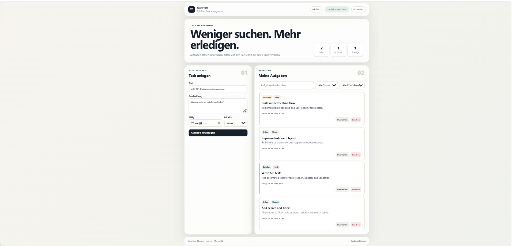
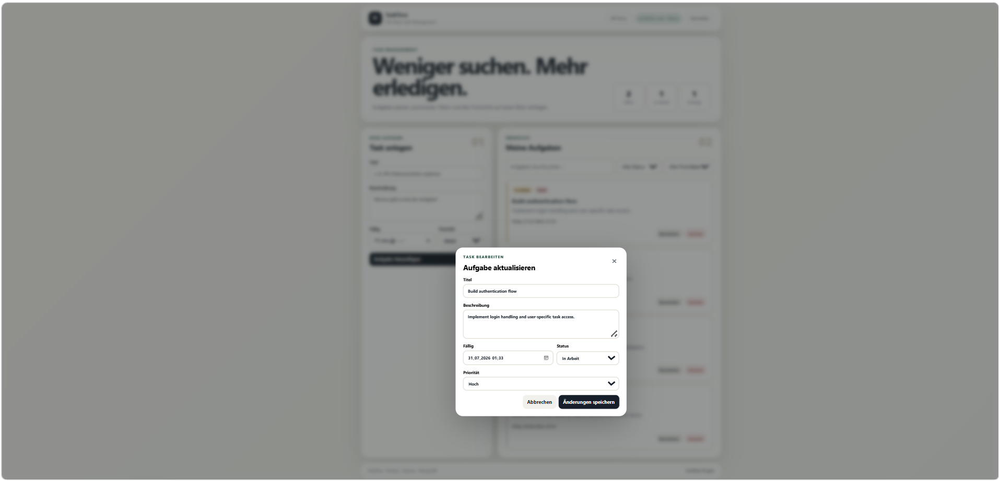
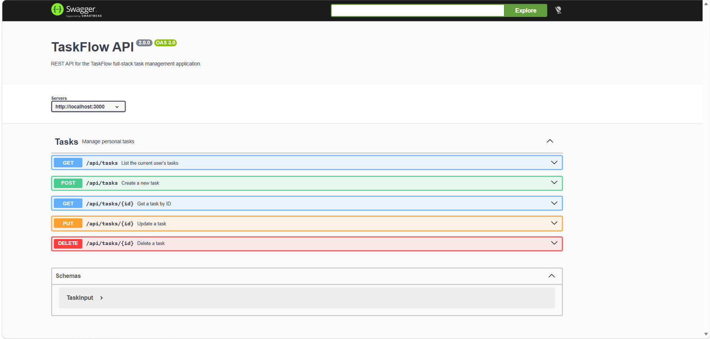

# TaskFlow

TaskFlow is a full-stack web application for managing personal tasks. It combines a responsive frontend with a REST API, MongoDB persistence, server-side validation, API documentation, automated tests, and optional OpenID Connect authentication.

## Features

- Create, edit, and delete tasks
- Task states: Open, In Progress, Done
- Priority levels: Low, Medium, High
- Search tasks by title and description
- Filter by status and priority
- Dashboard overview for task progress
- REST API with server-side request validation
- MongoDB persistence
- User-specific task separation
- Swagger / OpenAPI documentation at `/api-docs`
- Demo authentication for an easy local setup
- Optional OIDC/JWT authentication for external identity providers
- Automated API tests
- Docker setup for the application and MongoDB
- GitHub Actions CI workflow

## Screenshots

### Task Dashboard

The main dashboard provides an overview of tasks, priorities and current progress. Tasks can be searched, filtered and managed directly from the interface.



### Task Management

Tasks can be edited through a dedicated dialog, including title, description, status and priority.



### REST API Documentation

The backend exposes a documented REST API using Swagger / OpenAPI.




## Tech Stack

### Frontend
- HTML5
- CSS3
- JavaScript
- ES Modules

### Backend
- Node.js
- Express
- express-validator

### Database
- MongoDB

### Authentication
- Demo authentication for local development
- OpenID Connect / JWT for external identity providers

### Testing
- Node.js built-in test runner
- In-memory repository for isolated API tests

### Documentation & Tooling
- OpenAPI / Swagger
- Docker
- Docker Compose
- Git
- GitHub Actions

## Getting Started

### Option A: Docker

The easiest way to run TaskFlow locally is with Docker.

```bash
docker compose up --build
```

After the containers have started:

- Application: `http://localhost:3000`
- API documentation: `http://localhost:3000/api-docs`
- Health check: `http://localhost:3000/health`

### Option B: Node.js + Local MongoDB

Requirements:

- Node.js 22 or newer
- MongoDB

Install the backend dependencies:

```bash
cd backend
npm install
```

Start the development server:

```bash
npm run dev
```

TaskFlow runs in demo authentication mode by default. Configuration values can be provided through environment variables based on `.env.example`.

## Running Tests

From the `backend` directory:

```bash
npm test
```

The API test suite uses an in-memory repository, so a running MongoDB instance is not required.

The tests cover:

- Service health
- Frontend delivery
- Creating tasks
- Updating tasks
- Deleting tasks
- Input validation
- Status and search filtering

## Project Structure

```text
taskflow/
├── frontend/
│   ├── index.html
│   ├── styles.css
│   └── js/
│       ├── api.js
│       ├── main.js
│       └── ui.js
│
├── backend/
│   ├── src/
│   │   ├── auth/
│   │   ├── repositories/
│   │   ├── routes/
│   │   ├── app.js
│   │   ├── config.js
│   │   ├── openapi.js
│   │   └── server.js
│   └── tests/
│
├── docs/
├── .github/
│   └── workflows/
├── Dockerfile
├── docker-compose.yml
└── README.md
```

## Architecture

TaskFlow separates the user interface, HTTP API, and persistence layer.

The browser communicates with the Express backend through a JSON REST API. The route layer handles validation and delegates persistence operations to a repository. MongoDB is used in normal application operation, while tests can replace it with an in-memory repository.

This separation keeps the HTTP layer independent from MongoDB implementation details and makes the API easier to test and extend.

More details are available in [`docs/architecture.md`](docs/architecture.md).

## Authentication

TaskFlow supports two authentication modes.

### Demo Mode

The default mode is designed for local development and portfolio demonstrations. It does not require an external identity provider.

### OIDC Mode

For external authentication, TaskFlow supports an OpenID Connect provider and validates JWT access tokens.

Sensitive values such as client secrets are configured through environment variables and are not stored in the repository.

See [`.env.example`](.env.example) for the available configuration options.

## Security

The project follows several basic security practices:

- Secrets are excluded from version control
- OIDC credentials are provided through environment variables
- Access tokens can be stored in HTTP-only cookies
- Task input is validated on the server
- Tasks are associated with the authenticated user
- Environment files are excluded through `.gitignore`

See [`SECURITY.md`](SECURITY.md) for additional information.

## Background

TaskFlow started from an earlier learning project and was later extensively redesigned and expanded as a personal portfolio project.

The portfolio version includes a new application structure, redesigned frontend, repository abstraction, task priorities, search and filtering, portable authentication, Docker support, automated tests, API documentation, continuous integration, and removal of project-specific credentials.

## License

This project is licensed under the MIT License. See [`LICENSE`](LICENSE) for details.
