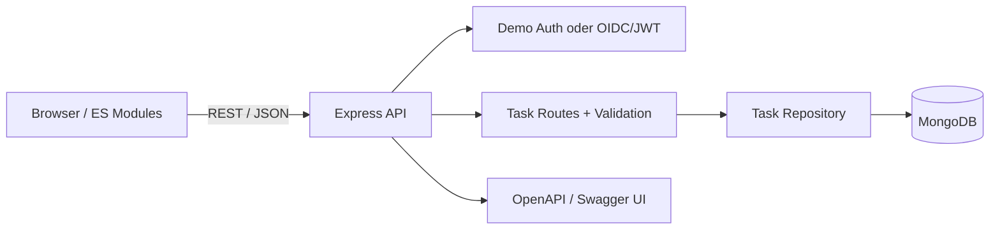

# Architektur

## Entscheidungen

### Repository-Schicht
Die HTTP-Routen kennen keine MongoDB-Details. Dadurch kann das Persistenz-Layer ausgetauscht und die API mit einem In-Memory-Repository getestet werden.

### Auth-Modi
Der `demo`-Modus macht das Projekt lokal ohne externen Identity Provider startbar. Für reale Deployments kann `AUTH_MODE=oidc` verwendet werden. OIDC-Endpunkte und Credentials liegen ausschließlich in Umgebungsvariablen.

### Frontend ohne Framework
Das Frontend nutzt bewusst Browser-ES-Modules. API-Zugriffe und UI-Rendering sind getrennt, sodass eine spätere Migration zu React ohne Änderung der REST-API möglich ist.
